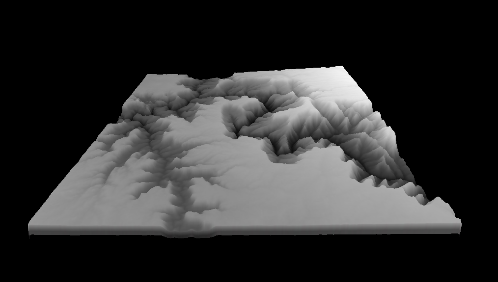
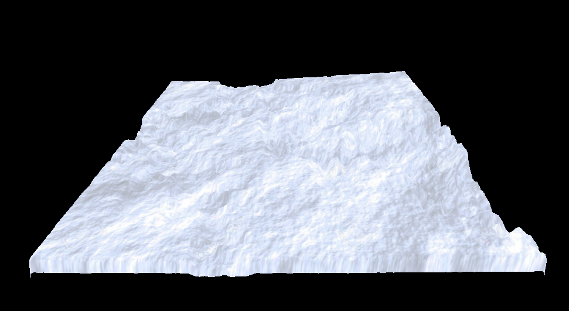

# Three.js Mesh Manipulation
Terrain with HeightMap as Texture:

Using Terrain as Texture(Snow):

Video of Wave Plane:
[Cool Video link](https://drive.google.com/file/d/1Ndg83dFeQmtufIWqX6vEqXfp82gwI88I/view?usp=sharing)

Video of Water + Terrain (Also sonic goes fast across the scene):
[Even Cooler Video Link](https://drive.google.com/file/d/1k8yYSqc4yUkrlskzwLl66GtWSL36k-tR/view?usp=sharing)

# Partner Check-in
I finished the Lab pretty early on so my partner was not finished By the time I wished to submit.
I will update this section if my partner does a check-in with me once they are finished.
However, as it is now my partner and I did not help each other out with parts of the lab.